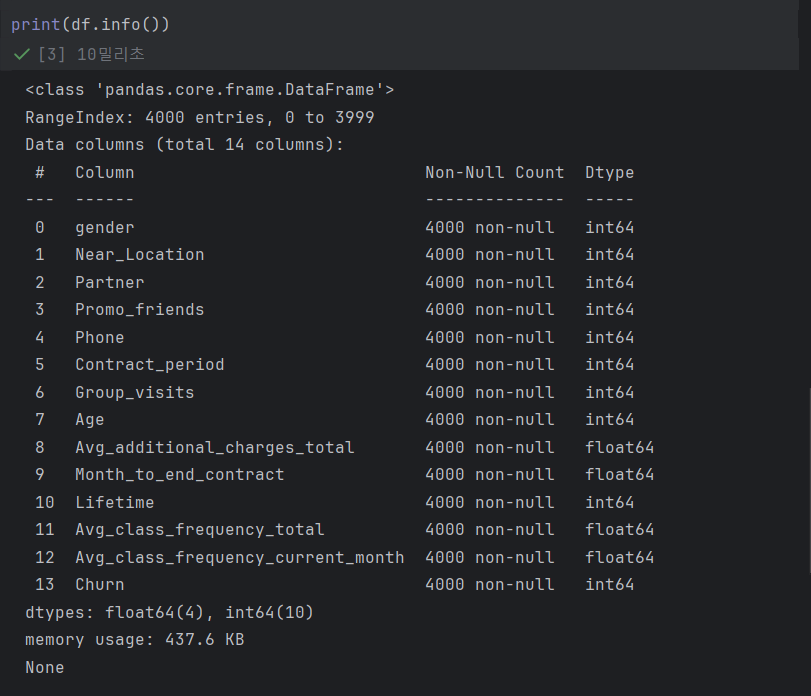
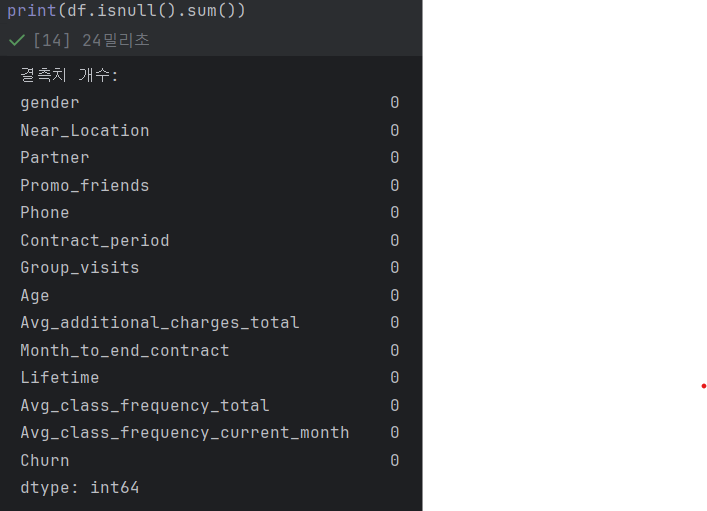
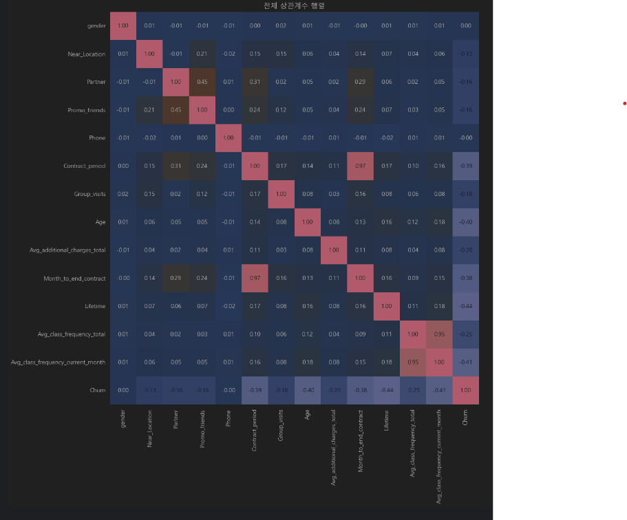

# SK Networks AI CAMP 14기 - 4st Team:   
- **개발 기간:** 2025.06.05 ~ 2025.06.06

---

# 📌 목차

1. [팀 소개](#1️⃣-팀-소개)
2. [프로젝트 개요](#2️⃣-프로젝트-개요)
3. [기술 스택](#3️⃣-기술-스택)
4. [데이터 전처리 결과서](#5️⃣-데이터-전처리-결과서-eda)
5. [머신러닝 분석 및 결과](#6️⃣-머신러닝-분석-및-결과)
6. [기대효과 및 전략](#7️⃣-기대효과-및-전략)
7. [회고](#7️⃣-회고)

 

----

# 1️⃣ **팀 소개**
### 팀명, '근육경찰'이란?
- "근육경찰 팀은 헬스장에서 조용히 사라지는 고객,
즉 **이탈 도둑**을 미리 감지하고 막기 위해 이 프로젝트를 시작했습니다."
- 우리는 고객 데이터를 기반으로, **이탈 가능성이 높은 회원을 사전에 식별하고 대응하는 머신러닝 기반 예측 시스템**을 구축했습니다.

 

### 팀원 소개

| [@문상희]()                                               | [@강윤구]()                                                 | [@김광령]()                                               | [@유용환]()                                               | [@이나경]()                              |
|--------------------------------------------------------|----------------------------------------------------------|--------------------------------------------------------|--------------------------------------------------------|---------------------------------------|
|  |  |  |  |  |

 

----
# 2️⃣ **프로젝트 개요**

## 1. 프로젝트 개요

 

## 2. 필요성 및 배경

 
----

# 3️⃣ **기술 스택**

### 협업 및 문서화  

 

### 🛠 협업 및 문서화  
 
  
 

### 💻 도구  

 

### 😺 형상 관리
 
  
 

### 🚀 프로그래밍 언어  
  
 

### 📊 데이터 분석  
 
  
 

### 🤖 머신러닝  
  
 

### 📈 데이터 시각화  
 
  
 

### 🔗 대시보드  
  

 

----

# 4️⃣ **데이터 전처리 결과서 (EDA)**
### **Feature 설명**
| Feature 이름                          | 설명                           |
| ----------------------------------- | ---------------------------- |
| `gender`                            | 성별 (0: 여성, 1: 남성)            |
| `Near_Location`                     | 헬스장이 집과 가까운지 여부 (1: 가까움)     |
| `Partner`                           | 배우자/파트너가 있는지 여부 (1: 있음)      |
| `Promo_friends`                     | 친구 추천 혜택을 받았는지 여부            |
| `Phone`                             | 연락 가능한지 여부 (1: 가능)           |
| `Contract_period`                   | 계약 기간 (단위: 개월)               |
| `Group_visits`                      | 그룹 수업 참여 여부 (1: 참여)          |
| `Age`                               | 나이                           |
| `Avg_additional_charges_total`      | 기타 추가 서비스 비용의 평균값            |
| `Month_to_end_contract`             | 계약 종료까지 남은 개월 수              |
| `Lifetime`                          | 가입 후 총 이용 개월 수               |
| `Avg_class_frequency_total`         | 전체 기간 평균 수업 참여 빈도            |
| `Avg_class_frequency_current_month` | 최근 한 달 수업 참여 빈도              |
| `Churn`                             | 이탈 여부 (0: 잔류, 1: 이탈) ← 타겟 변수 |

### 데이터 확인

 

### 결측치 확인

 

### 시각화

 

## 분석결과

#### **1. 데이터 구조 및 결측치 확인** 
- 전체 데이터는 총 4,000건, 변수는 총 14개로 구성되어 있음 
- df.info() 및 df.isnull().sum() 결과, 결측치는 존재하지 않음
→ 전 변수에 대해 추가적인 결측치 처리 없이 분석 가능
#### **2. 이상치 탐색**
- 수치형 변수들을 대상으로 이상치 탐색을 수행
- 일부 변수에서 극단적인 값들이 관찰되었으나, 데이터 오류나 이상 입력값은 아님
→ 따라서 제거 없이 유지하고 모델링에 반영
#### **3. 타겟 변수(Churn) 분포 확인**
- 고객 이탈 여부인 Churn 변수는 0(잔류), 1(이탈)의 이진 분류 형태이며, 
- countplot 시각화 결과:
  - 잔류 회원: 약 73.5%
  - 이탈 회원: 약 26.5%

- 클래스 불균형이 존재하므로, f1-score 중심 평가 필요
#### **4. 상관관계 분석**
- 전체 수치형 변수 간의 상관계수 행렬을 시각화함 
- 그중, Churn과의 상관계수 절댓값이 0.1 이상인 변수를 피처로 선별(phone 제외)
#### **5. 모델링을 위한 정리**
- 주요 범주형 변수(gender, Partner, Near_Location 등)는 이미 숫자형으로 인코딩되어 있음 
- 별도의 원-핫 인코딩 등 전처리 없이 즉시 모델 학습에 투입 가능 
- 이상치 유지, 범주형 인코딩 완료, 주요 변수 선별 등 기반 위에 모델 구축 진행

  

 

---

# 5️⃣ **머신러닝,딥러닝 분석 및 결과**

| Model                  | Accuracy | F1-score | Precision | Recall |
| ---------------------- | -------- | -------- | --------- | ------ |
| **DNN**                | 0.9463   | 0.8969   | 0.9122    | 0.8821 |
| MLPClassifier          | 0.9350   | 0.8738   | 0.9000    | 0.8491 |
| XGBClassifier          | 0.9337   | 0.8723   | 0.8916    | 0.8538 |
| SVC                    | 0.9387   | 0.8808   | 0.9095    | 0.8538 |
| LogisticRegression     | 0.9325   | 0.8696   | 0.8911    | 0.8491 |
| LGBMClassifier         | 0.9287   | 0.8620   | 0.8856    | 0.8396 |
| RandomForestClassifier | 0.9125   | 0.8259   | 0.8737    | 0.7830 |
| DecisionTreeClassifier | 0.8838   | 0.7759   | 0.7931    | 0.7594 |
| KNeighborsClassifier   | 0.8750   | 0.7619   | 0.7692    | 0.7547 |

- 총 9개의 모델(Logistic Regression, SVC, Random Forest, XGBoost, LightGBM, KNN, Decision Tree, MLPClassifier, DNN)을 학습
- 정확도(Accuracy), 정밀도(Precision), 재현율(Recall), F1-score를 주요 평가지표로 사용

#### 최종 선정 모델: DNN (Deep Neural Network)
- F1-score 기준으로 **가장 우수한 성능(0.8969)**을 기록하였으며,
- Precision과 Recall이 모두 고르게 높아 이탈 고객을 정확히 식별하고 놓치지 않는 모델로 평가됨 
- 스케일링 전처리와의 조합을 통해 안정적인 성능을 발휘함

 

-----

# 6️⃣ **기대효과 및 전략**
 

----

# 7️⃣-회고

#### **문상희**
- 안녕하세요
#### **강윤구**
- 안녕하세요
#### **김광령**
- 안녕하세요
#### **유용환**
- 안녕하세요
#### **이나경**
- 안녕하세요

----
